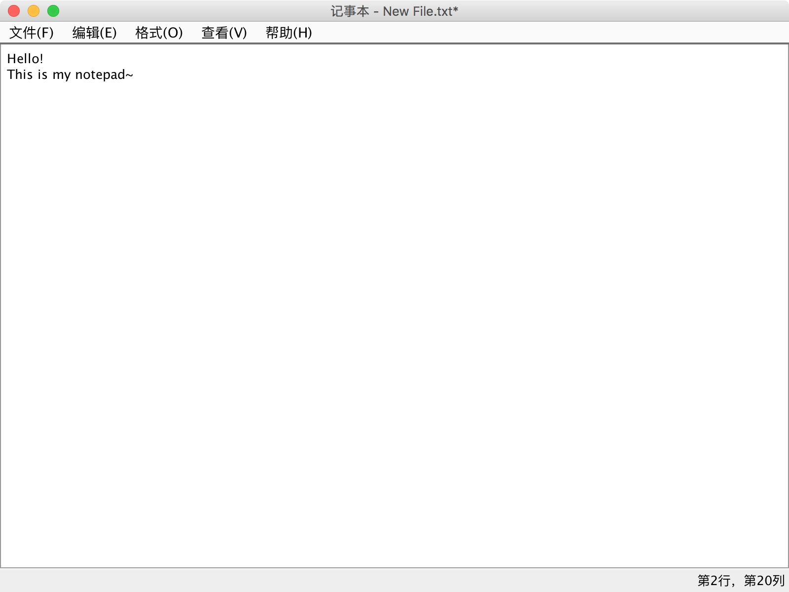
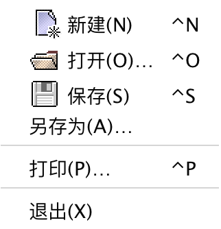
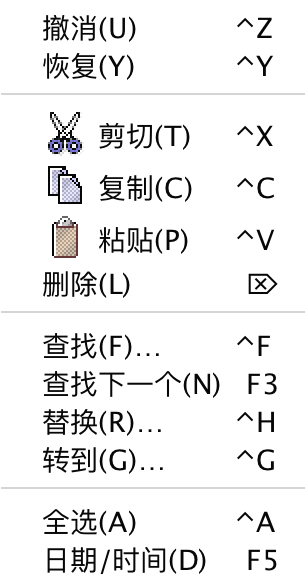

# 记事本（Java）

仿照windows系统记事本，实现了标题栏、菜单栏、状态栏等的UI。功能上实现了文件、编辑、格式、查看、帮助菜单。

该记事本具体功能有：
+ 文件的新建、打开、保存、另存功能
+ 退出功能
+ 撤消、恢复功能
+ 剪切、复制、粘贴、删除功能，跳转到指定行功能
+ 全选、日期时间功能，自动换行功能
+ 查看行号、状态栏、全屏功能
+ 以及查找、替换、字体功能（未实现）

> 注意：已实现复制、粘贴、剪切功能，已实现撤消、恢复功能
> 
> 已实现状态栏显示光标行列信息功能，已实现显示行号、全屏功能。

欢迎大家下载、体验，随时欢迎各位与我沟通、交流。Email: cn.binbin@qq.com

部分截图如下：
+ 主窗口截图

+ 关于截图

+ 部分菜单截图

文件菜单：

编辑菜单：

关于菜单：

更多精彩内容，等您来发现哟 ~ 
